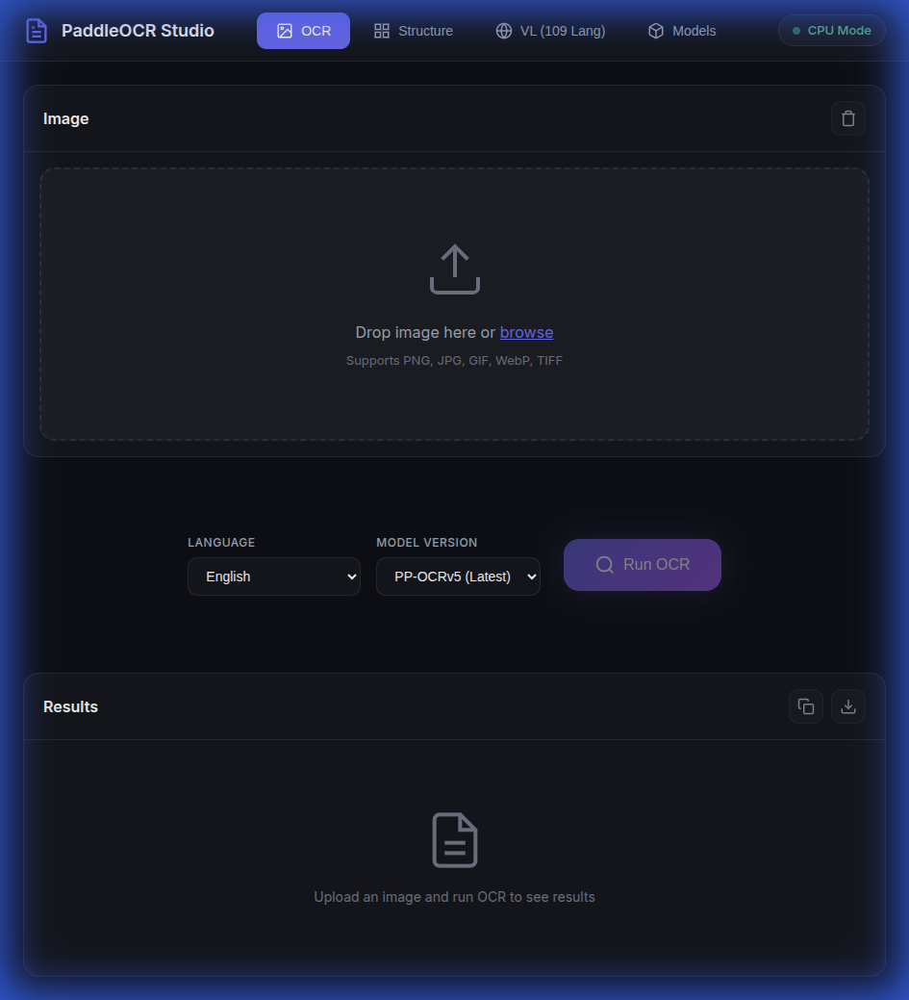
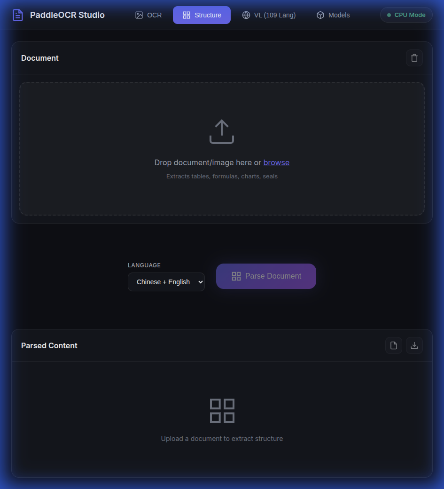
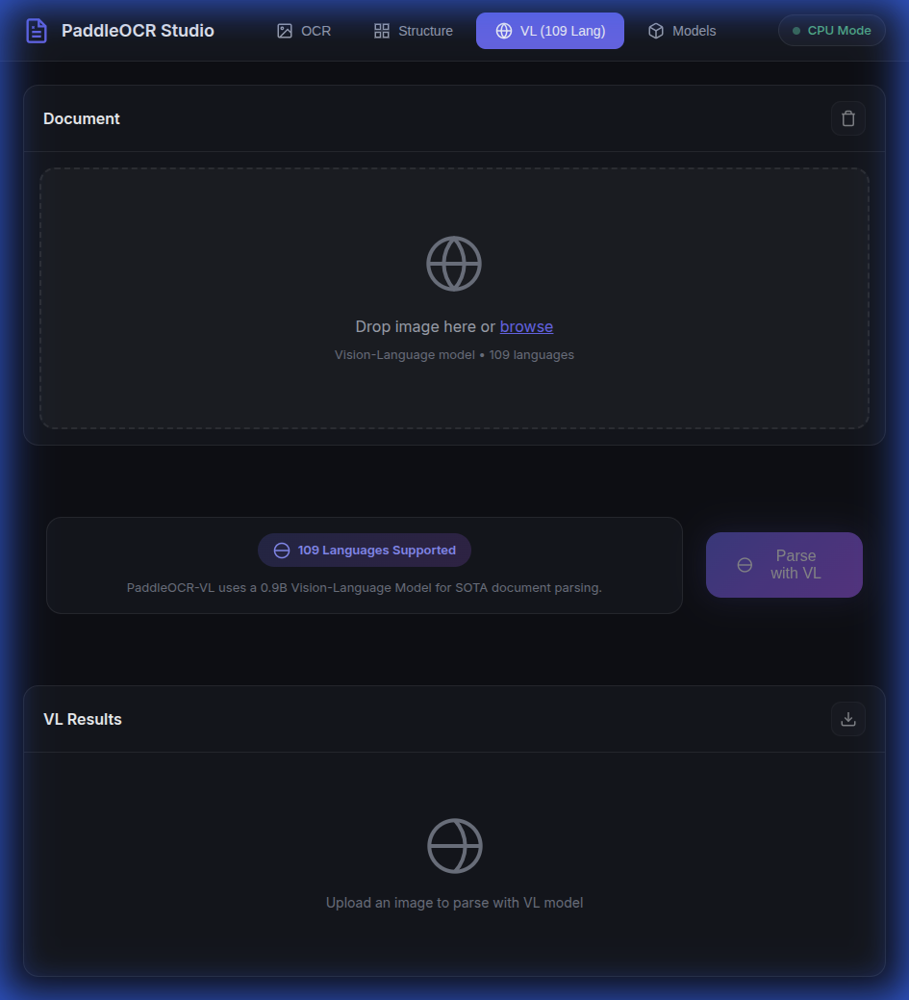
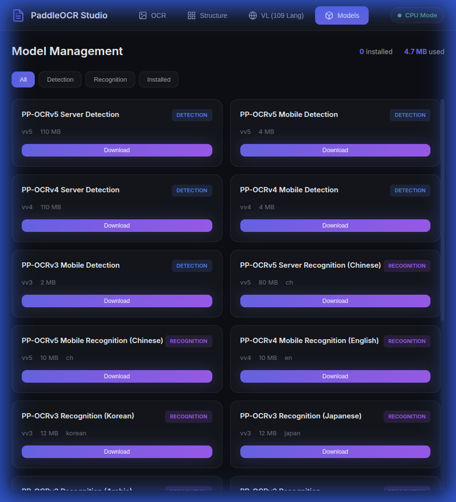

# PaddleOCR Studio (paddle-ui)

A modern web-based OCR application powered by PaddleOCR 3.x with advanced document parsing capabilities.

##  Features

###  OCR Mode (PP-OCRv5)
- **109+ languages supported** - From Chinese, Japanese, Korean to Arabic, Hindi, Thai, and many more
- Text detection and recognition with PP-OCRv5 (latest), PP-OCRv4, PP-OCRv3
- Image preprocessing (brightness, contrast, saturation, sharpness)
- Bounding box visualization
- Languages grouped by script/region for easy selection
- Export results to JSON

###  Structure Mode (PP-StructureV3)
- **PDF and image support** - Parse multi-page PDF documents
- Layout detection (text, titles, tables, formulas, charts, seals)
- Table recognition  HTML output
- Formula recognition  LaTeX output
- Chart parsing with data extraction
- Seal text recognition
- Export to Markdown/JSON with preserved structure
- Per-page results for PDF documents

###  VL Mode (PaddleOCR-VL)
- Vision-Language Model (0.9B parameters)
- 109 languages supported
- SOTA document parsing performance
- Complex element recognition (text, tables, formulas, charts)
- Markdown and JSON output

###  Model Management
- Download/delete models on demand
- Disk usage tracking
- Filter by model type (detection, recognition, classification)
- Model registry with version info

##  Quick Start

### Prerequisites
- Python 3.10+
- Conda (recommended)

### Installation

`bash
# Clone the repository
git clone https://github.com/yourusername/paddle-ui.git
cd paddle-ui

# Create conda environment
conda create -n paddle python=3.10 -y
conda activate paddle

# Install dependencies
pip install paddlepaddle paddleocr flask flask-cors pillow opencv-python-headless numpy requests

# For PDF support (optional but recommended)
pip install pymupdf

# Run the application
python app.py
`

Open http://localhost:5000 in your browser.

###  Docker (Recommended)

`bash
# Clone the repository
git clone https://github.com/yourusername/paddle-ui.git
cd paddle-ui

# Build and run with Docker Compose
docker-compose up -d

# Or build manually
docker build -t paddle-ui .
docker run -p 5000:5000 -v paddleocr-models:/root/.paddleocr paddle-ui
`

Open http://localhost:5000 in your browser.

> **Note**: First run will download PaddleOCR models (~500MB). Models are persisted in a Docker volume.

##  Project Structure

`
paddle-ui/
 app.py                  # Flask application with API endpoints
 ocr_engine.py           # PP-OCR wrapper (109+ languages)
 structure_engine.py     # PP-StructureV3 wrapper (PDF + images)
 vl_engine.py            # PaddleOCR-VL wrapper
 model_manager.py        # Model download/management
 image_processor.py      # Image preprocessing utilities
 templates/
    index.html          # Main UI template
 static/
     css/
        style.css       # Modern dark theme styles
     js/
         app.js          # Frontend logic with dynamic language loading
`

##  API Endpoints

| Endpoint | Method | Description |
|----------|--------|-------------|
| /api/ocr | POST | Basic OCR processing |
| /api/structure | POST | PP-StructureV3 document parsing (images + PDF) |
| /api/vl | POST | PaddleOCR-VL parsing |
| /api/languages | GET | List all supported OCR languages |
| /api/language-groups | GET | Languages organized by script/region |
| /api/models | GET | List available models |
| /api/models/<id>/download | POST | Download a model |
| /api/models/<id> | DELETE | Delete a model |

##  Supported Languages (109+)

### East Asian
Chinese (Simplified & Traditional), Japanese, Korean

### European (Latin Script)
English, German, French, Spanish, Italian, Portuguese, Dutch, Polish, Romanian, Swedish, Norwegian, Danish, Finnish, Czech, Hungarian, Croatian, Slovenian, Slovak, and more...

### Cyrillic Script
Russian, Ukrainian, Belarusian, Bulgarian, Serbian, Macedonian, Mongolian, Kazakh, Kyrgyz, Tajik

### Arabic Script
Arabic, Persian/Farsi, Urdu, Pashto, Uyghur, Kurdish, Sindhi

### Indic Scripts
Hindi, Marathi, Nepali, Sanskrit, Bengali, Assamese, Gujarati, Punjabi, Odia, Tamil, Telugu, Kannada, Malayalam, Sinhala

### Southeast Asian
Thai, Lao, Myanmar/Burmese, Khmer, Vietnamese, Indonesian, Malay, Filipino

### Other Scripts
Greek, Hebrew, Amharic, Tigrinya, Georgian, Armenian

##  Screenshots

### OCR Mode

### Structure Mode (PP-StructureV3)

### VL Mode (PaddleOCR-VL)

### Model Management

##  License

This project is licensed under the Apache 2.0 License - see the [LICENSE](LICENSE) file for details.

##  Acknowledgments

- [PaddlePaddle/PaddleOCR](https://github.com/PaddlePaddle/PaddleOCR) - The OCR engine powering this application
- [Flask](https://flask.palletsprojects.com/) - Web framework
